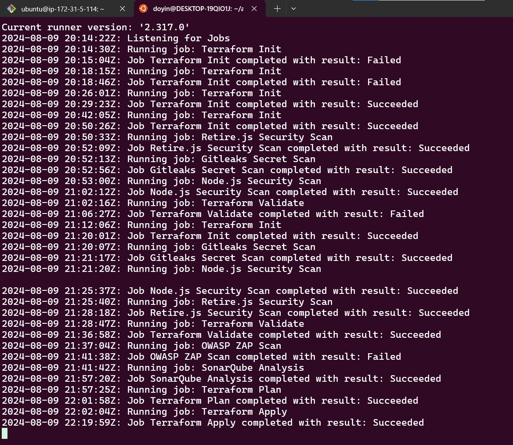

Here’s an enhanced version of your README with all the suggested markdown styling for better visual appeal:

---

# CI/CD Pipeline with SonarQube and OWASP ZAP Integration

 "CI/CD Pipeline Overview"

> **Note:** This project was done as part of my DevSecOps journey.

---

## Overview

This project was part of my **DevSecOps Journey** and demonstrates the integration of a CI/CD pipeline using GitHub Actions with SonarQube and OWASP ZAP security tools. The pipeline is set up to automate the process of initializing Terraform, validating configurations, performing security scans, and applying changes. This document walks you through the steps taken to set up the pipeline and explains key decisions, including the manual provisioning of resources and handling errors.

---

## Steps Followed

### 1. **Provisioning the SonarQube Server**
   - **Purpose:** SonarQube was manually provisioned on an EC2 instance to perform code quality analysis and generate an authentication token.
   - **Reasoning:** A dedicated SonarQube server was necessary to manage the quality gate for the project. This step was performed before running the GitHub Actions to ensure all prerequisites were met.

    "SonarQube Analysis Results"

     "SinarQube Analysis Result"

### 2. **Provisioning an S3 Bucket**
   - **Purpose:** An S3 bucket was provisioned to securely store Terraform state files.
   - **Reasoning:** Managing state files in S3 ensures consistency and provides a centralized location that can be accessed by multiple users or CI/CD pipelines.

### 3. **Setting Up a Self-Hosted GitHub Action Runner**
   - The pipeline is executed using a self-hosted runner, as shown in the provided image below. This runner is configured to handle the specific environment requirements needed for this project.

   ![GitHub Action Runner] "Self-Hosted GitHub Action Runner"

### 4. **CI/CD Pipeline Configuration**
   The CI/CD pipeline is defined in the `github-ci.yml` file. It consists of several stages:
   1. **Terraform Init:** Initializes Terraform configuration and prepares the working directory.
   2. **Terraform Validate:** Validates the Terraform configuration.
   3. **Security Scans:**
      - **Gitleaks:** Checks for sensitive information in the codebase.
      - **Node.js Security Scan:** Scans the Node.js dependencies for vulnerabilities.
      - **Retire.js:** Checks for vulnerabilities in JavaScript libraries.
   4. **SonarQube Analysis:** Runs a code quality scan using SonarQube.
   5. **OWASP ZAP Scan:** Performs a security baseline scan using OWASP ZAP.
   6. **Terraform Plan and Apply:** Creates and applies an execution plan for the infrastructure.

   

---

## Handling the OWASP ZAP Failure

- **Issue:** The OWASP ZAP scan failed with the following error:
  ```bash
  Unable to find image 'owasp/zap2docker-stable:latest' locally
  docker: Error response from daemon: pull access denied for owasp/zap2docker-stable, repository does not exist or may require 'docker login': denied: requested access to the resource is denied.
  Error: Process completed with exit code 125.
  ```
- **Reason:** The error occurred because the Docker image `owasp/zap2docker-stable` could not be pulled due to access restrictions or the image not existing in the Docker repository.
- **Impact on the Pipeline:** Despite the failure of the OWASP ZAP scan, the pipeline continued and completed the other stages successfully. This is because the pipeline is designed to allow individual steps to fail without causing the entire workflow to stop.

   "OWASP ZAP Failure"

---

## Pipeline Execution and Results

- The pipeline was triggered via a push event, as shown in the image below.
- The steps were executed in sequence, and the final output indicates that all necessary jobs were completed, with the exception of the OWASP ZAP scan.
- The results of the SonarQube analysis can be seen in the provided screenshots, indicating that the code passed all quality gates with an 'A' rating.

  
  

---

## Conclusion

This CI/CD pipeline is designed to integrate security scanning tools like SonarQube and OWASP ZAP into a Terraform-managed infrastructure. While the OWASP ZAP scan failed due to a Docker image issue, the pipeline was resilient enough to continue with the other steps, ensuring that the Terraform configurations were validated and applied successfully. The images provided in the repository offer visual confirmation of each step's execution and results.

For more detailed insights and the visual outputs, please refer to the images in the `images/` directory of this repository.

---

**Adedoyin Ekong**  
*DevSecOps*


